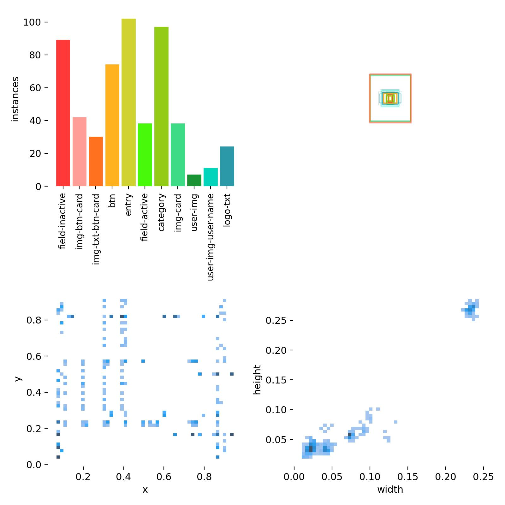
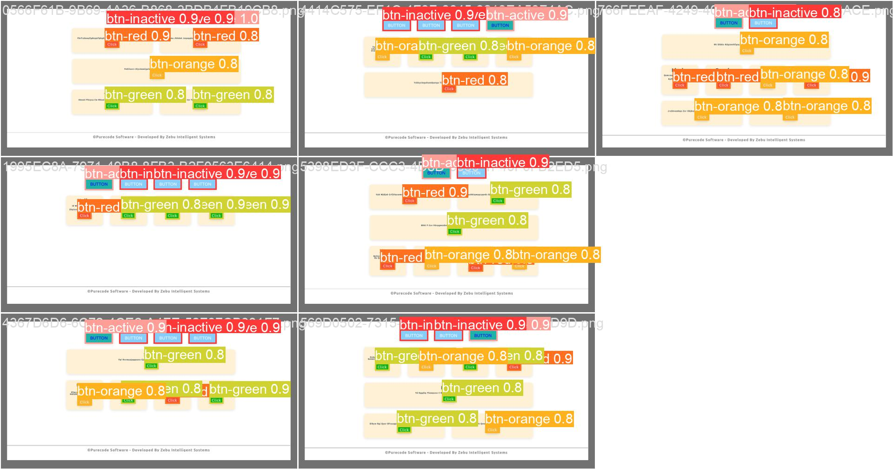
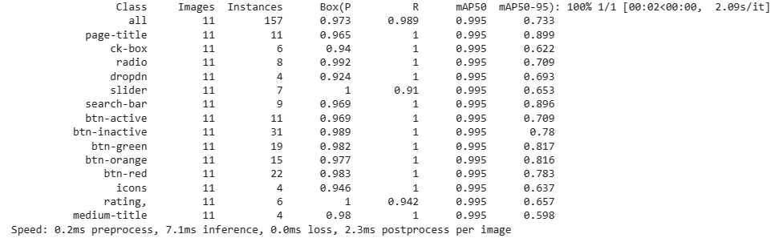

####  Task1
I have provide short Exploratory Data Analysis in Task1.doc

####  Task2
The dataset D1, D2 and D3 could be treated as detection datasets.  Although the annotations are texts, the problem can be handled in 2 stages.

1. Use a detection model to extract the UI components.
2. Use a text parser to generate the text file in required format.


### Annotation
To annotate the data I have used open source tool LabelImg https://pypi.org/project/labelImg/.
 There were 300 images in each of the set. I have approximately annotated 50 from each set.

| Dataset                                                                                        | Images Annotated | 
| -------------------------------------------------------------------------------------------- | --------------------- | 
|D1|36|
|D2|59|
|D3|50|

Looking at time constraint I have gone for annotating fewer images. 

#### D1 Data
<br>
</a>
<br>
<br>

#### D2 Data
<br>
</a>
<br>
<br>

#### D3 Data
<br>
</a>
<br>
<br>

## Data Format
Data is converted in to standard YOLO format.

## Data Split
A split ratio of 80:20 for train and validation is used. This split is carried on annotated images. The non-annotated imaged could be treated as test set.

##  YOLOv8
YOLO series of models are SOTA for detection purpose. YOLOv8 is designed to be fast, accurate, and easy to use. I prefer this as it is easy to set up on google colab considering GPU constraint.

Similarly, earlier versions of YOLO could be used.

The details are provided in https://github.com/ultralytics/ultralytics

### Setting up pipeline
<summary>Install</summary>

Pip install the ultralytics package including
all [requirements.txt](https://github.com/ultralytics/ultralytics/blob/main/requirements.txt) in a
[**Python>=3.7**](https://www.python.org/) environment with
[**PyTorch>=1.7**](https://pytorch.org/get-started/locally/).
To use ultralytics yolov8:

```bash
pip install ultralytics
```
## Source code
I have attached the google colab file which was used for train and validation.


## Train
Once the environment is set, the following CLI command could be used to trigger training.

```bash
yolo task=detect mode=train model=yolov8s.pt data=<path_to_config_yaml_file> epochs=100 imgsz=640 batch=8 project=<dir_path_to_save_weights_and_results> name=<folder_name_where_results_will_be_saved> ```
```
### Logs
I have kept training logs under log folder.

### D1 Train result
<br>
</a>
<br>
<br>

### D2 Train result
<br>
</a>
<br>
<br>

### D3 Train result
<br>
</a>
<br>
<br>

#### Validation
```bash
yolo val model=<path_to_model_weights_file> data=<path_to_dataset_config_yaml>
```

### D1 Validation result
<br>
</a>
<br>
<br>
<br>
</a>
<br>
<br>

### D2 Validation result
<br>
</a>
<br>
<br>

<br>
</a>
<br>
<br>


### D3 Validation result
<br>
</a>
<br>
<br>

<br>
</a>
<br>
<br>


### Infer

```python
from ultralytics import YOLO

yolo predict model="<saved_weights_path>" source=<image_path>

```

| Dataset                                                                                        | Good Prediction | 
| -------------------------------------------------------------------------------------------- | --------------------- | 
|D1|36|
|D2|59|
|D3|50|


## Postprocessing

The co-ordinates of the bounding boxes along with labels are helpful in generating the text.

To run postprocess run scrips/prostprocessor.py on yolo output text file.

<br>
</a>
<br>
<br>

```

header {
btn-inactive, btn-inactive, btn-active, btn-inactive, btn-inactive
}
row {
double {
small-title, text, btn-green
}
double {
small-title, text, btn-green
}

}
row {
single {
small-title, text, btn-orange
}

}
row {
quadruple {
small-title, text, btn-orange
}
quadruple {
small-title, text, btn-green
}
quadruple {
small-title, text, btn-red
}
quadruple {
small-title, text, btn-green
}

}

```

This postprocessor is only for D1. It could be generalized for D1, D2 and D3.


### Weights

Weights and config file for each model is available at 

https://drive.google.com/drive/folders/156Cxd2QxO92X1OwvlF9R2Di8s3-KjkTJ?usp=share_link


## End-2-End Image-to-Text ( Alternative approach )

In this approach, Images are directly converted to desired text. 

Code: Image-Text.ipynb

### Model 

Encoder - google/vit-base-patch16-224-in21k

Decoder - GPT2


### Dataset

The model was trained on D1 dataset ( GPU resource constraint ). 200 images were used. A 80:20 train:val split was used.


### Training

Trained for 50 epochs. ( Memory and GPU constraint).  The model is underfit after 50 epochs. 

Train log for same is provided in img-to-text.log

```
TrainOutput(global_step=4000,
 training_loss=0.03121483838558197, 
 metrics={'train_runtime': 2929.962, 'train_samples_per_second': 2.73, 'train_steps_per_second': 1.365, 
 'train_loss': 0.03121483838558197,
  'epoch': 50.0
  })

```

### Inference
For input image FECC1897-8B91-426B-96F3-29DA91E30721.png

This is the output of model:

```
header {
 btn-inactive, btn-inactive, btn-active

```

## Conclusion
We could used both the approaches depending on the data and complexity.  If dataset size is large, we could use second approach. 1st approach would be applicable with lesser data and more accuracy. Maintaining the parser becomes overhead in that case. 
